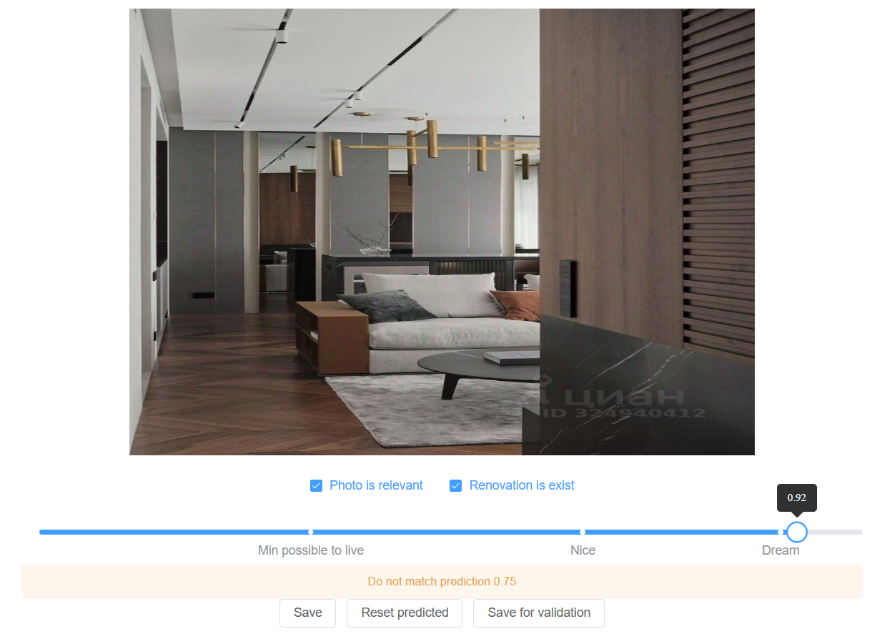
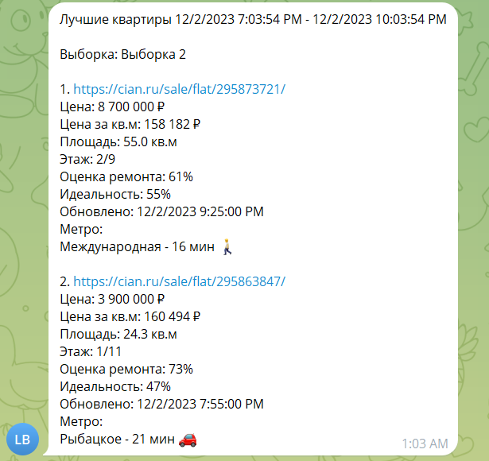
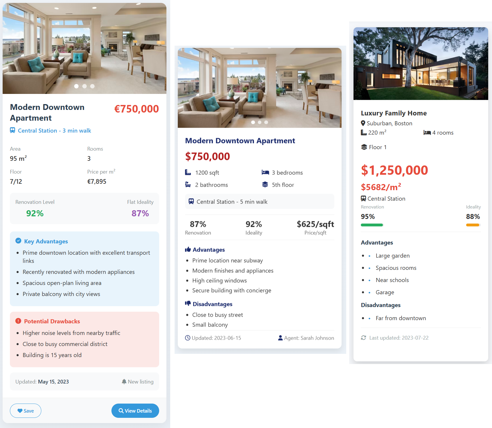

---
title: Как я пытался ранжировать квартиры по их фотографиям
type: article
projects: [crawler]
description: The project highlights a journey of iterative design and problem-solving in the realm of web scraping.
createdAt: 2025-10-07
updatedAt: 2025-12-05
---
## Как появилась идея
Покупка квартиры - достаточно сложное и дорогое дело. Хочется выбрать лучшее из того, что есть на рынке и не прогадать по цене.
С такими мыслями наша семья начинала поиски квартиры на вторичном рынке в Санкт Петербурге в начале 2023 года.

Объявления в России можно искать на многочисленных площадках с недвижимостью: Циан, Авито, Дом Клик и т.д. У каждого
свой функционал, свои объявления, которых может быть очень много. Я пытался просмотреть все, которые подходили по параметрам 
"станция метро", "время до метро", "максимальная цена", "минимальная площадь". Но вскоре понял, что объявлений
слишком много и их просмотр становится второй работой. К тому же мы были готовы пожертвовать частью параметров,
если цена будет действительно хорошей. Но для этого пришлось бы просматривать вообще все объявления, что удовлетворяют
определенному ценовому диапазону, и пытаться как-то ранжировать их в своей голове.

Нужно было какое-то автоматическое ранжирование, чтобы видеть только хорошие варианты, не занимаясь просмотром всего подряд.
Вообще у Авито, например, есть информационное уведомление о том, что "цена в рынке". Но чтобы его увидеть, нужно было
проваливаться в объявление, да и что за этим скрывалось и как анализировалось - было не очень понятно. К тому же
у разных площадок были свои механики и абсолютное сравнение становилось сложным. В идеале хотелось бы взять и выполнить
сортировку по самым выгодным предложениям по всем площадкам.

Да, я понимал, что самые выгодные предложения - это скорее всего те, где ты в итоге
останешься и без квартиры и без денег. Но была надежда на дополнительные фильтрации, которые отсекут совсем нереальные варианты.
Например, при средней цене в 250 тысяч рублей за квадратный метр, предложения по 150 тысяч выглядели очень подозрительно.

## Формулирование задачи
Рассуждения звучали здраво, и я загорелся мыслью - написать приложение для авторанжирования объявлений. И было совсем не важно,
что на написание такого функционала уйдет гораздо больше времени, чем на ручной просмотр объявлений в течение нескольких лет.

Но перед тем, как что-то писать, необходимо было определиться, что хочется в итоге получить.
Была сформулирована такая цель: необходим сервис, который будет собирать объявления с разных платформ. Далее, каждому из
объявлений должен был присваиваться параметр, стоит ли квартира своих денег. Параметр мог быть числом от 0 до 1.
На основании этого числа уже можно было бы делать сортировку.

Оставалось придумать определение - когда квартира стоит своих денег. По моим меркам, выгодная квартира - 
это та, которая за цену квадрата предлагает больше, чем аналогичные в данной локации. Ее, в случае чего, хотя бы можно
продать без сильных потерь.

Конечно, в настоящем мире все не так просто. Дома могут быть разные, рядом находиться полезные социальные объекты или
вредные заводы. Но хотелось уже начать с чего-нибудь, и не усложнять систему раньше времени. Пока остановился на том, что:
1. Среди рядом расположенных двух квартир с одинаковым ремонтом лучше та, что дешевле.
2. Среди рядом расположенных двух квартир с разным ремонтом лучше та, что предлагает меньшую стоимость за условную
единицу ремонта.

Оставалось самое сложное - придумать, как оценивать ремонт.
У некоторых агрегаторов были параметры, вроде "тип ремонта: евроремонт". Но такие параметры заполнялись вручную создателем
объявления и могли не соответствовать истине. Реализация на всех площадках была разная, или отсутствовала вовсе. То есть
готовых параметров для оценки ремонта не существовало, а значит, настало время пробовать силы в Machine Learning - получать оценку
ремонта на основании фотографий. Ведь фотографии у объявления есть всегда.

## Обучение нейронной сети
В начале 2023 года еще не существовало LLM моделей на любой случай жизни. И основной стратегий было обучение
модели с нуля или дообучение похожей Open Source модели под конкретную задачу. Основная проблема была в том, что я был 
.NET разработчиком с околонулевым опытом работы с ML. Все, что доводилось когда-то делать, были небольшие модели
для распознавания букв на основе датасета [mnist](https://www.kaggle.com/datasets/hojjatk/mnist-dataset).
И то, такие модели обучались почти полностью пошагово по руководствам.

### Требования к датасету
Для того чтобы обучить модель, нужен было сначала собрать датасет. Поскольку планировалось распознавать изображения
с сайтов недвижимости, было решено скачать с них какое-то количество фотографий для разметки. Была написана небольшая утилита,
которая прошлась по страницам Циана, собрала пачку ссылок на изображения (порядка 5 тысяч) и загрузила их на
локальный диск. Оставалось разметить этот датасет.

Перед тем как начать процесс разметки, я долго просматривал загруженные фотографии. Нужно было понять, что вообще можно 
на них увидеть. А увидеть можно было много чего - фотографии деревьев из окон, рендеры домов и помещений, фото 
санузлов крупным планом. Был сделан вывод - далеко не все фото релевантны. Часть из них никак не поможет в оценке.
Кроме того, некоторая доля изображений содержала новые квартиры с черновой отделкой. Такие объявления
вообще не хотелось бы рассматривать, ведь это почти первичная недвижимость со своим ценообразованием.

Исходя из этих выводов, лучшим решением на тот момент показалось сделать три модели:
1. Первая определит, квартира на фото или нет. Не квартиры, или же изображения не представляющие ценности,
например, фото вазы, должны вернуть `false`.
2. Вторая должна отсеять те квартиры, на которых изображен голый бетон.
3. Третья должна выдать оценку, от 0 до 1, где 1 - это ремонт мечты.

Далее, все три модели должны были вызываться из ASP NET приложения и возвращать результат предсказания, используя
следующий алгоритм:
```csharp
public record PredictionResult
{
    public bool IsRelevant { get; init; }
    public bool HasRenovation { get; init; }
    public float Rating { get; init; }
}

var isRelevant = await model1.IsRelevantAsync(imageBytes);
if (!isRelevant) return new PredictionResult(); // Изображение нерелевантно

var hasRenovation = await model2.HasRenovationAsync(imageBytes);
if (!hasRenovation) return new PredictionResult { IsRelevant = true }; // Изображение релевантно, но на фото черновая отделка

var rating = await model3.GetRenovationRating(imageBytes);
return new PredictionResult { IsRelevant = true, HasRenovation = true, Rating = rating }; // Изображение релевантно и получена оценка
```

### Сбор датасета
Чтобы ускорить маркировку датасета, и не допустить логических ошибок при простановке признаков, был сделан небольшой редактор
на Vue JS + ASP NET:

В интерфейс был добавлен placeholder для сообщения о том, что думает об изображении текущая модель 
("Do not match predicted value 0.75"). Был план собрать 
минимальный набор изображений, обучить модель и уже при разметке датасета выводить в этом поле результат предсказания.
Такой подход позволил бы видеть, на каких изображениях модель больше всего ошибается, да и процесс разметки мог стать чуть веселее.
Пока же этот placeholder выводил статичный текст.

### Написание моделей
После сбора датасета из сотни фотографий, пришла пора заняться обучением моделей. Нужно было понять, заработает ли вообще вся
эта система. Я пригляделся к запланированным к реализации моделям.
Первые две из них должны были возвращать boolean ответ - что было похоже на задачу бинарной классификации. 
Третья должна была возвращать число от 0 до 1 - задача линейной регрессии.

Началось изучение, как все это можно реализовать. Из похожих задач удалось найти что-то про предсказывание стоимости дома на основании
набора параметров. Но там использовался текст на входе и про изображения ничего не было. А все модели, который работали с 
изображениями обычно были многоклассовыми классификаторами.

В конечном итоге было решено просто скрестить найденные варианты решения задач бинарной классификации и линейной регрессии,
которые работали с текстом и слои какой-то модели, что работала с изображениями. Нужно же было с чего-то начинать.
Это было решение, использовавшее keras + tensorflow. 

Модель бинарной классификации:
```py
inputs = keras.Input(shape=(self.image_width, self.image_width, 3))
x = tf.keras.layers.Conv2D(filters=32, kernel_size=5, activation='relu')(inputs)
x = tf.keras.layers.MaxPool2D()(x)
x = tf.keras.layers.BatchNormalization()(x)
x = tf.keras.layers.Conv2D(filters=48, kernel_size=5, activation='relu')(x)
x = tf.keras.layers.MaxPool2D()(x)
x = tf.keras.layers.BatchNormalization()(x)
x = tf.keras.layers.Conv2D(filters=64, kernel_size=3, activation='relu')(x)
x = tf.keras.layers.MaxPool2D()(x)
x = tf.keras.layers.BatchNormalization()(x)
x = tf.keras.layers.Conv2D(filters=80, kernel_size=3, activation='relu')(x)
x = tf.keras.layers.MaxPool2D()(x)
x = tf.keras.layers.BatchNormalization()(x)
x = tf.keras.layers.Conv2D(filters=96, kernel_size=3, activation='relu')(x)
x = tf.keras.layers.MaxPool2D()(x)
x = tf.keras.layers.BatchNormalization()(x)
x = tf.keras.layers.Flatten()(x)
x = tf.keras.layers.Dropout(0.5)(x)
x = tf.keras.layers.Dense(256, activation='relu')(x)
outputs = tf.keras.layers.Dense(2, activation=tf.keras.activations.softmax)(x)

model = keras.Model(inputs, outputs, name="binary")
model.compile(optimizer=tf.keras.optimizers.RMSprop(learning_rate=1e-3),
              loss=tf.keras.losses.binary_crossentropy,
              metrics=[tf.keras.metrics.AUC()])
              
=================================================================
Total params: 210,594
Trainable params: 209,954
Non-trainable params: 640
_________________________________________________________________
```
Регрессионная модель:
```
inputs = keras.Input(shape=(self.image_width, self.image_width, 3))

x = tf.keras.layers.Conv2D(filters=16, kernel_size=3, activation='relu')(inputs)
x = tf.keras.layers.MaxPool2D()(x)
x = tf.keras.layers.BatchNormalization()(x)
x = tf.keras.layers.Conv2D(filters=32, kernel_size=3, activation='relu')(x)
x = tf.keras.layers.MaxPool2D()(x)
x = tf.keras.layers.BatchNormalization()(x)
x = tf.keras.layers.Conv2D(filters=64, kernel_size=3, activation='relu')(x)
x = tf.keras.layers.MaxPool2D()(x)
x = tf.keras.layers.BatchNormalization()(x)
x = tf.keras.layers.Flatten()(x)
x = tf.keras.layers.Dropout(0.5)(x)
x = tf.keras.layers.Dense(512, activation='relu')(x)
outputs = tf.keras.layers.Dense(1, activation=tf.keras.activations.sigmoid)(x)

model = keras.Model(inputs, outputs, name="EfficientNet")
model.compile(optimizer=tf.keras.optimizers.Adam(learning_rate=1e-3),
              loss=tf.keras.losses.binary_crossentropy,
              metrics=[tf.keras.metrics.MeanAbsoluteError()])

=================================================================
Total params: 22,176,225
Trainable params: 22,176,001
Non-trainable params: 224
_________________________________________________________________
```

### Подключение моделей к редактору датасета
Обучение было успешно запущено на сете из 90 изображений (10 использовались для валидации). На выходе модели сохранялись в формате `h5`.
Размер их получился следующим:
```
furniture_score.h5 - 32.8MB
is_photo_relevant.h5 - 1.76MB
is_renovation_exists.h5 - 1.76MB
```
Теперь нужно было подключить модели к редактору датасета.
Для использования их в .NET была взята библиотека [Keras.NET](https://github.com/SciSharp/Keras.NET).
Этот пакет позволял описывать модели, используя Keras в .NET, а также выполнять их запуск. Это не очень эффективно, но избавляло от
необходимости разбираться с Python WEB приложениями и их деплоем.

Запуск модели в .NET требовал передачи объекта типа `NdArray` в качестве параметра (аналог numpy array). В то же время библиотека 
позволяла получить такой объект только передав в специальную утилиту путь к файлу на диске. Существующий массив
байт конвертировать в `NdArray` было невозможно. Из-за этого код запуска модели выглядел так:
```csharp
var tempFileName = $"{Guid.NewGuid()}.temp";
File.WriteAllBytes(tempFileName, imageBytes);

var image = ImageUtil.LoadImg(tempFileName, target_size: (imageWidth, imageHeight, colorsCount));
File.Delete(tempFileName);

var ndArray = ImageUtil.ImageToArray(image) / maxPixelValue;

var model = BaseModel.LoadModel(path);
model.Predict(ndArray);
```
Код заработал. А значит вскоре в интерфейсе разметки датасета появилась возможность видеть, что на данный момент
думает модель о каждом из изображений. Пока результаты были больше похоже на случайные. Но разметка датасета продолжалась.

### Проблемы с качеством
Вскоре стало заметно, что очень тяжело объективно ставить оценку от 0 до 1 для каждой фотографии. Значения 0.85 и 0.8 были очень
близки и конечный результат выбирался скорее по настроению. Необходимо было сформулировать какие-то критерии, когда какую оценку ставить,
но мотивации что-то выдумывать не было, ведь пришлось бы заново просматривать уже размеченный датасет.
Хотелось скорее увидеть результат в работе, пусть и неидеальный. Было решено продолжить разметку на основе субъективных
ощущений и оставить все проблемы с качеством на потом.

Метрики моделей постепенно улучшались, но прогрессия остановилась на ~500 изображениях. Были попытки взять готовую модель,
и сделать дообучение. Но это только ухудшало результаты (возможно, ввиду отсутствия опыта).
Были попытки изменить количество слоев, параметров, функции активации, увеличить датасет. Каких-то значимых изменений это
не приносило.

При увеличении количества параметров, модели явно уходили в переобучение. При этом больший размер датасета, всякого рода
случайные повороты и масштабирование изображений, добавление слоев Dropout ситуацию кардинально не меняли.
В итоге я остановился на следующих результатах при датасете в ~2к изображений:
1. Квартира ли на фото, точность предсказания (val_auc) ~ 0.92
2. Есть ли ремонт, точность предсказания (val_auc) ~ 0.95
3. Определение уровня ремонта, средняя ошибка (val_mae) ~0.17

## Создание приложения
### Первый план
Настало время писать приложение. Закапываться в проектирование интерфейсов не хотелось и для старта было решено создать обычного
Telegram бота. Пользователь сможет зайти в его настройки, выбрать параметры интересующих объявлений. А бот будет уведомлять о 
новых объявлениях, что попали под заданные параметры.

Предполагался следующий набор сервисов:
1. **CrawlingHost**: данный сервис будет находить новые объявления и складывать их в локальную базу, получив некоторую
оценку ремонта перед сохранением.
2. **TelegramApiHost**: в данный хост летят запросы от бота в Telegram, в котором можно настроить уведомления о новых
объявлениях.
3. **WorkerHost**: периодически запускается, делает выборки объявлений и отправляет их пользователям.

### Написание краулера
Чтобы собирать актуальные объявления, предполагалась следующая последовательность:
1. На каждом из сайтов необходимо было получить статичную ссылку на список объявлений, отсортированных по дате размещения,
начиная с самых новых. Обычно в ссылках был параметр - номер страницы. Его необходимо было бы менять при пагинации.
2. При запуске краулера, нужно было собрать все объявления со страницы. Если находилось объявление, которое уже сохранено в базе с 
той же датой обновления, считалось, что парсер добрался до ранее сохраненных объявлений.
В таком случае процесс можно нужно останавливать и ждать следующего запуска.
3. Также при сборе данных необходимо было исключить проблему с race condition. Это ситуация, когда во время парсинга кто-то
выкладывал новое объявление. Из-за этого при переходе на следующую страницу, краулер мог увидеть объявление, только
что собранное на предыдущей странице.  
Чтобы такие ситуации не останавливали процесс, пункт 2 был доработан, введением понятия "crawling session". В
рамках каждой сессии собирался массив идентификаторов встреченных объявлений. Если загруженное объявление находилось в
списке обработанных в данной сессии, то оно уже не останавливало процесс при повторной встрече.
4. Также предусматривался максимальный порог "старости" объявления. Например, если какому-то из найденных 
объявлений было уже более месяца, сессию парсинга нужно было останавливать. Без этого при первом запуске краулер пытался
бы перебрать все объявления площадки.

Само по себе написание краулера не было сложным. Он был реализован как фоновая задача - BackgroundJob, который включался
раз в 4 часа и собирал все, что появилось с момента последнего запуска. 
Сам биндинг разметки сайта к C# объекту был сделан через библиотеку `Laraue.Crawling`, которая 
позволяла определить схему, избегая лишнего спагетти-кода:
```csharp
public sealed class CianCrawlingSchema : CompiledDocumentSchema<IElementHandle, HtmlSelector, CrawlingResult>, ICianCrawlingSchema
{
    private static BindObjectExpression<IElementHandle, HtmlSelector> GetSchema(ILogger logger)
    {
        return new PuppeterSharpSchemaBuilder<CrawlingResult>()
            .HasArrayProperty(x => x.Advertisements, "article", pageBuilder =>
            {
                pageBuilder.HasProperty(
                    x => x.ShortDescription,
                    "div[data-name=Description]");
                pageBuilder.HasProperty(
                    x => x.UpdatedAt,
                    builder => builder
                        .UseSelector("div[data-name=TimeLabel] div:nth-child(2)")
                        .Map(TryParseDate));
                // ...
            })
            .Build()
            .BindingExpression;
    }
}
```
Далее через headless браузер с помощью библиотеки `PuppeterSharp` открывалась одна из страниц ресурса и данные из верстки
биндились на модель, согласно схеме.

Чтобы не бороться с защитой от ботов, было решено просто сократить запросы до такого уровня, когда защита не будет срабатывать.
Опытным путем было получено значение в один запрос в минуту. Этого хватало: поток объявлений на самом деле не велик.
В результате этого шага были написаны схемы для Циана и Авито, каждая из которых возвращала результат согласно контракту: 
```csharp
public sealed class CrawlingResult
{
    public Advertisement[] Advertisements { get; init; } = [];
}

public sealed class Advertisement
{
    public string Id { get; init; } = string.Empty;
    public string Link { get; init; } = string.Empty;
    public long TotalPrice { get; init; }
    public int RoomsCount { get; init; }
    public decimal Square { get; init; }
    public int FloorNumber { get; init; }
    public int TotalFloorsNumber { get; init; }
    public string? ShortDescription { get; init; }
    public DateTime? UpdatedAt { get; init; }
    public string[] ImageLinks { get; init; } = [];
    public FlatType FlatType { get; init; }
    public TransportStop[]? TransportStops { get; init; }
    public FlatAddress? FlatAddress { get; init; }
}
```
Перед сохранением результата в базу, необходимо было проставить оценку ремонта для квартиры. Для этого отдельные оценки
изображений должны были свестись в одну общую. Желательно было учесть и несовершенство моделей. План был следующим:
1. Необходимо получить оценку для всех фотографий в объявлении.
2. Если найдено менее 3-х релевантных изображений, ставится общая оценка 0, чтобы объявление в дальнейшем не участвовало в поиске.
3. Если найдены изображения с черновой отделкой - общая оценка 0.
4. Для остальных изображений находится медиана, чтобы избежать влияния изображений с резким отклонением от среднего.
5. Здесь также появился первый концепт параметра идеальность - чем больше у квартир проблем, тем меньше ее идеальность.
К проблемам относятся плохой ремонт, долгое расстояние до метро, не лучшие станции метро, и так далее. В итоге для идеальности
получалась формула:
```csharp
var totalFine = transportStopFine + transportDistanceFine + renovationRatingFine;
var ideality = 1 - totalFine; // Для высчитывания идельности вычитаем из единицы все штрафы
```

База начала наполняться данными. Их оставалось вывести.

### Интерфейс бота в Telegram
По задумке, пользователь мог создать себе некоторые "выборки" (Selection): 
```csharp
public sealed record Selection
{
    public long Id { get; set; }
    public required string Name { get; set; }
    public Guid UserId { get; set; }
    public MayBeRelativeDate? MinDate { get; set; }
    public MayBeRelativeDate? MaxDate { get; set; }
    public decimal? MinPrice { get; set; }
    public decimal? MaxPrice { get; set; }
    public int? MinRenovationRating { get; set; }
    public int? MaxRenovationRating { get; set; }
    public decimal? MinPerSquareMeterPrice { get; set; }
    public decimal? MaxPerSquareMeterPrice { get; set; }
    public decimal? MinSquare { get; set; }
    public bool ExcludeFirstFloor { get; set; }
    public bool ExcludeLastFloor { get; set; }
    public byte? MinMetroStationPriority { get; set; }
    public AdvertisementsSort SortBy { get; set; }
    public SortOrder SortOrderBy { get; set; }
    public IList<long>? MetroIds { get; set; }
    public IList<int>? RoomsCount { get; set; }
    public TimeSpan? NotificationInterval { get; set; }
    public DateTime? SentAt { get; set; }
    public int PerPage { get; set; }
}
```


И в рамках созданных выборок просмотреть объявления:


Процесс вывода объявлений в телеграмме подробно описывать не буду. Там достаточно много кода, но все сводится к тому,
чтобы достать записи из БД по фильтрам из выборки и отрисовать их в интерфейсе. В любом случае, код будет доступен в репозитории.

С этого момента в телеграм можно было просматривать собранные с разных платформ объявления.

### WorkerHost
Оставалось доработать систему, добавив автоотправку новых объявлений по выборкам. Работало это в два этапа:
1. Отбирались те выборки, данные по которым пришло время отправлять. Но это влиял параметр "интервал отправки", 
установленный пользователем.
2. Происходило формирование запроса к базе для выборки новых данных. Для этого отбирались объявления, удовлетворяющие
условию фильтров выборки и в которых поле `crawled_at` было больше, чем дата последней автоотправки по этой выборке.

Пример уведомления:



Все сервисы теперь были реализованы. Можно было запускать их и наблюдать за результатами.

## Полученные результаты и покупка квартиры
Хосты приложения были развернуты на купленный VPS c 1GB RAM под linux. Не осталось точных данных, сколько RAM и CPU тратилось 
на распознавание одного изображения, но цифры были вполне удовлетворительные для корректной работы системы. 

Были созданы две выборки. Первая была настроена на локации, что были нам наиболее интересны.
Вторая выборка распространялась на весь Санкт-Петербург и искала квартиры с хорошим ремонтом, рядом
расположенным метро при низкой цене за квадрат. Наблюдения начались.

Система работала. Уведомления приходили. Оценка ремонта, в основном отсеивала неприемлемые варианты. Но
действительно интересных приложений было мало. Каждые 4 часа приходило новое уведомление (или не приходило, если в выборку 
ничего не попадало) и необходимо было смотреть, что нашла система. Всегда находились какие-то минусы, делающие варианты
не подходящими. Через пару недель этот процесс поднадоел - постоянно нужно было идти и просматривать объявления.
Шаг уведомления был изменен с четырех до двенадцати часов. Правда, в таком варианте был риск упустить действительно хорошие
предложения.

В итоге, судьба покупки была решена в один из дней за пару часов. Жена, просматривая Циан, увидела новое объявление, подходящее
нам по всем характеристикам в хорошей локации. Через час объект был просмотрен, а на следующее утро заключена предварительная сделка.
Через месяц мы уже переезжали.

Это все было хорошо, но мотивация развития приложения сильно снизилась. Было понятно, что нужно как-то улучшать
точность распознавания, но знаний для этого не хватало. Нужно было добиваться уменьшения фонового шума от бота - ведь 
не так страшно пропустить что-то важное, как получать постоянно что-то нерелевантное. Одна из новых идей была - смотреть
на наличие слова "срочно" в объявлении - на таких объявлениях часто есть обоснованные скидки.

Но было непонятно, для кого сейчас делается эта разработка. Силы уходили на переезд, наступило лето - пора прогулок -
постепенно интерес к разработке угас.

## Реинкарнация проекта
### Откуда взялась новая идея
2024 и 2025 год шли под девизом - LLM повсюду, что провоцировало некоторое отторжение от этой тематики. Каждый второй
теперь рассказывал, как ИИ консультирует его по совершенно разнообразным вопросам, а CEO компаний объявляли наперебой,
что скоро мир изменится и множество профессий вымрет. 

У меня же появилось мнение, что если начать использовать LLM в своей работе, то это в перспективе 
плохо скажется на способности писать код. И если вдруг в будущем окажется, что LLM не получается сделать рентабельным
и их отключат, или же серьезно поднимут стоимость использования, то в выигрыше останутся те, кто не разучился писать код
самостоятельно.

Правда вечно избегать использования LLM мне не удалось. С каждым месяцем я ощущал деградацию поисковых систем.
Возможно, это были субъективные ощущения, но с каждым месяцем все тяжелее было получать ответы на свои вопросы.

Я опросил знакомых о том, кто что использует. Программисты в основном сидели в DeepSeek, остальные в каких-то
сомнительных телеграм ботах с названиями вида "Free Chat GPT 4 Bot".

Мне же повезло наткнуться на проект Ollama, который позволял запускать Open Source модели на локальном
компьютере. И этот концепт очень понравился, ведь в таком случае все данные всегда были на локальном компьютере.
Это как энциклопедия всего интернета в виде одного файла - и при этом никакой рекламы. Кроме того, если модели как-то
и будут меняться со временем и деградировать, то твоя локальная останется такой же, как и была.

Были перепробованы много моделей, в итоге на постоянном использовании остались две: `qwen3-coder:30b` для вопросов по 
программированию и `gemma3:12b` для всего остального. Логичным следующим вопросом было - а сможет ли LLM делать оценку ремонта
по фотографии и каковы будут результаты?

### Эксперименты с Ollama
Первой идеей было просто спросить у одной из моделей, что она видит на фото, передав ей url изображения с Циана. 
К удивлению, модель подробно расписала, что изображено на фото, почти полное совпадение. Был отправлен другой url - снова подробное описание квартиры,
но почти ничего не совпало.

В итоге оказалось, что модель не умела даже загружать фото по url, хотя ответ и возвращала всегда. Она просто
на основании того, что в адресе был "cian", предполагала, что это фото квартиры, а дальше генерировала какой-то случайный
результат.

В итоге я изучил документацию и обнаружил, что с изображениями может работать только часть моделей. И передавать их нужно
отдельным свойством в виде base64 строки. Кроме того, оказалось, что Ollama поддерживает функцию structured output, что позволяло задать
контракт объекта, который модель должна вернуть по сделанному запросу. 

В итоге был составлен такой запрос, который просил у модели вернуть данные по фото в нужном формате:
```json
{
  "model" : "qwen2.5vl:3b",
  "prompt" : "Analyze this image and determine if it depicts a flat interior...",
  "stream" : false,
  "images" : ["base64ImageString"],
  "format" : {
    "properties" : {
      "RenovationRating" : {
        "type" : [ "number" ]
      },
      "Tags" : {
        "items" : {
          "type" : [ "string" ]
        },
        "type" : [ "array" ]
      },
      "Description" : {
        "type" : [ "string" ]
      }
    },
    "type" : [ "object" ]
  }
}
```
В промпте передавался длинный набор подсказок, чтобы модель понимала, что должно увеличивать оценку, а что - уменьшать.
Например, использование дорогих материалов - это плюс, а торчащие коммуникации - это минус. Также объяснялось, 
что представляет каждое из запрошенных свойств и описывались правила, когда модель должна считать изображение нерелевантным 
и возвращать нуль. Также было решено спрашивать у модели число от 0 до 10, а не как ранее от 0 до 1. Модели меньше 
галлюцинировали, работая с целыми числами.
Ответ выглядел так:
```json
{
    "model": "qwen2.5vl:3b",
    "response": "{\"Tags\": [\"Empty room\",\"No furniture\",\"Unfinished walls\",\"No design solutions\",\"No color scheme\"],\"Description\": \"The image shows an empty room with unfinished walls and no furniture. The room appears to be in the process of being renovated, as the walls are not yet painted and there are no visible design solutions or color schemes. The lack of furniture and the unfinished state of the walls suggest that the flat requires significant renovation before it can be lived in.\"}"
}
```
Оценка действительно выполнялась. Вопрос был только в том, насколько хорошо и какая из моделей имеет лучшие результаты.

### Выбор новой модели
Было решено сделать небольшой тест: выбрать 20 разнообразных изображений и получить результаты оценки от каждой из моделей. 
Сам тест выглядел так:
```csharp
[Theory]
[InlineData("qwen2.5vl:7b")]
[InlineData("qwen2.5vl:3b")]
[InlineData("gemma3:12b")]
[InlineData("gemma3:4b")]
[InlineData("llava:7b")]
[InlineData("llama3.2-vision")]
[InlineData("qwen3:8b")]
[InlineData("qwen3-vl:8b")]
public Task ModelsTest(string model)
{
    return RunTest(model, Prompts.Prompt1);
}
```
Тело теста содержало последовательный запуск на модели распознавания для каждого из предопределённых изображений и 
сравнение полученных результатов с эталоном:
```csharp
private async Task RunTest(string model, string prompt)
{
    var errors = new Dictionary<string, Result>();
    foreach (var image in _testImages)
    {
        var filePath =  "C:\\images\\" + image.Key;
        var fileBytes = await File.ReadAllBytesAsync(filePath);
    
        var result = await _predictor.Predict(
            model,
            prompt,
            fileBytes);
    
        errors.Add(image.Key, new Result
        {
            Tags = result.Tags,
            Diff = Math.Abs(result.RenovationRating - image.Value),
            Excepted = image.Value,
            Actual = result.RenovationRating,
            IsRelevant = result.IsRelevant,
        });
    }

    _outputHelper.WriteLine($"Average error: {errors.Values.Average(x => x.Diff)}");
    _outputHelper.WriteLine($"Error > 10%: {(errors.Values.Count(x => x.Diff > 1) / (double)errors.Count):P}");
    _outputHelper.WriteLine($"Error > 20%: {(errors.Values.Count(x => x.Diff > 2) / (double)errors.Count):P}");
    _outputHelper.WriteLine($"Relevant errors: {(errors.Values.Count(x => x.IsRelevant == (x.Excepted != 0)) / (double)errors.Count):P}");
    
    foreach (var error in errors)
    {
        _outputHelper.WriteLine(
            $"{error.Key}: {error.Value.Diff} ex: {error.Value.Excepted} act: {error.Value.Actual} tags: {string.Join(',', error.Value.Tags)}");
    }
}
```
Вывод теста:
```
Average error: 1.55
Error > 10%: 30.00%
Error > 20%: 20.00%
Relevant errors: 25.00%
2612468440-4.jpg: 0 ex: 3 act: 3 tags: Old furniture,Worn carpet,Wallpaper,Simple lighting,Basic layout
2612468528-4.jpg: 0 ex: 3 act: 3 tags: Old tiles,Basic fixtures,Needs paint,Simple layout,Basic lighting
2612468865-4.jpg: 5 ex: 0 act: 5 tags: Neutral colors,Simple design,Clean lines,Functional layout,Needs minor updates
...
```
Интересно было понимать не только среднюю ошибку, но и то сколько модель допускает грубых ошибок - например, когда 
оценивала ремонт там, где вообще не должна была. Кроме того модели, которые требовали много ресурсов или работали долго -
не рассматривались. В итоге, по соотношению цена-качество победила `qwen2.5vl:7b`. Оценка одного изображения занимала 
около пяти секунд на RTX4070.

### Улучшения в алгоритме распознавания
Полученные результаты были явно лучше, чем в самописной модели. Но хотелось понять, что можно еще улучшить.

По выводу теста я заметил, что достаточно много ошибок происходило в изображениях, в которых в принципе было мало информации
для оценки - какое-нибудь фото пустой стены с картиной. Хотя изображение в целом было релевантным.

Здесь родилась идея о том, что было бы круто объединить все фотографии и делать оценку всего объявления сразу. Тогда у 
модели будет больше информации и меньше шансов ошибиться. Это должно и работать быстрее - время работы модели не сильно
коррелировало с объемом входного файла. А количество распознаваний сокращалась до одного на всю квартиру.

Алгоритм был прост - все фотографии объявления объединялись в одно длинное и разделялись черными полосами.
В промпте было дописано о том, что необходимо оценивать переданный коллаж изображений, разделенных черными линиями.

Это сработало - общая оценка выросла. Правда, появилась проблема. Модель начинала периодически галлюцинировать 
и бесконечно генерировать теги. Промпты о том, что возвращать нужно не более 10 тегов, резко снижали результат оценки
квартиры и не всегда спасали от галлюцинаций.

Помог в итоге магический промпт, преложенный самой же моделью  - `return exactly no more than 10 items`. Это убрало
галлюцинации, не сильно снизив точность. 

В целом вся эта разработка через промпты, конечно, была такой себе. Абсолютно никакой детерминированности, любые изменения
могло резко ухудшить результат. К счастью, написанные тесты позволяли хоть как-то видеть общую картину и не делать
совсем уж неправильных решений.

### Внедрение в проект
Новое ядро системы для распознавания изображений было готово к внедрению в приложение. Однако теперь
запуск модели требовал мощной видеокарты, а сервер с GPU арендовать было дорого. Было решено, что домашний компьютер 
займется всей тяжелой работой. Для этого проект требовалось доработать.
1. Вся работа, что требовала видеокарты, была вынесена в отдельный хост - GpuWorkerHost. Парсинг был отрефакторен и
теперь не пытался получить оценку о ремонте сразу, а просто складывал свои результаты в базу. Затем уже GpuWorkerHost просматривал
объявления с несделанной оценкой, выполнял ее и обновлял результаты в БД.
2. Был добавлен ApiHost - захотелось вывести результаты красиво на нормальном фронтенде.
3. Появилась новая работа у WorkerHost - ему необходимо было просматривать объявления, что были оценены и проставлять им 
флаг - готово для API. Кроме того, в данный хост были добавлены задачи по периодическому удалению из базы тех изображений,
что перестали быть доступны и по помечанию флага об удалении для тех объявлений, у которых не осталось ни одного активного
изображения.

### Разработка фронтенда
Мне всегда тяжело было придумывать интерфейсы. Поэтому запросил несколько разных версток под эту задачу у `qwen3-coder:30b`:


Далее эти верстки были вручную объединены и доработаны напильником.

### Деплой хостов
Было решено деплоить на сервер только ApiHost, чтобы не тратиться лишний раз на вычислительные ресурсы.
Все остальные хосты не требовали постоянного запуска. Поэтому их можно было запустить в любое время локально,
чтобы они собрали новые объявления, сделали им оценку и сложили результаты в базу.

### Результат и дальнейшие планы
Изначальный план - отсортировать квартиры по самом выгодным предложениям до сих пор не был выполнен. Но был сделан шаг
в этом направлении: было решено искать квартиры, расположенные рядом на одной улице и сравнивая их цены и ремонт показывать, 
выгодная ли это сделка. Но такое работало только когда объявлений на улице много и было с чем сравнивать. По-правильному нужно
было использовать некоторую геобазу, по которой можно будет делать сравнение именно по ближайшим домам, а не только тем, что расположены
на одной улице. 


В голове крутились дальнейшие улучшения:
1. Сравнивать заявленные аттрибуты с текстом объявления. Часто пользователи пишут в характеристиках одно, а в описании 
совсем другое - шаг, чтобы привлечь внимание. Такое желательно сразу выкидывать с выдачи. 
2. Загрузить базы домов, идущих под реновацию, и снижать итоговую оценку или показывать уведомления об опасности сделки.
3. Объединять дубликаты по параметрам, очищая выборки.
4. Искать квартиры не только для покупки, но и для аренды.
5. Сделать так называемую дистилляцию модели. Это когда маленькую модель обучают на результатах большой. Тогда 
GpuHost оказался бы на сервере и его не приходилось бы запускать на локальном компьютере.

Идеи появлялись одна за другой, но появилась проблема - кажется, я снова устал разрабатывать данный проект. Сейчас его 
никак не получается применить, покупок квартиры не предвидится. Тем не менее он выглядит
интересным и хочется, чтобы знания, накопленные в нем, мог кто-нибудь использовать. Я выложил исходники на
[Github](https://github.com/win7user10/Laraue.Apps.RealEstate), если вдруг появится желание подробнее ознакомиться с
реализацией всего функционала. В репозитории отсутствует Frontend, его придется при необходимости писать самостоятельно. 

Ну а если хочется просто посмотреть полученный результат, он доступен [здесь](https://laraue.com/crawled-apartments).
Изначально проект делался под Санкт-Петербург, поэтому там больше всего данных. Москву и Волгоград я добавлял позднее,
чтобы убедиться, что проект можно масштабировать.

На этом все, всем спасибо за внимание!